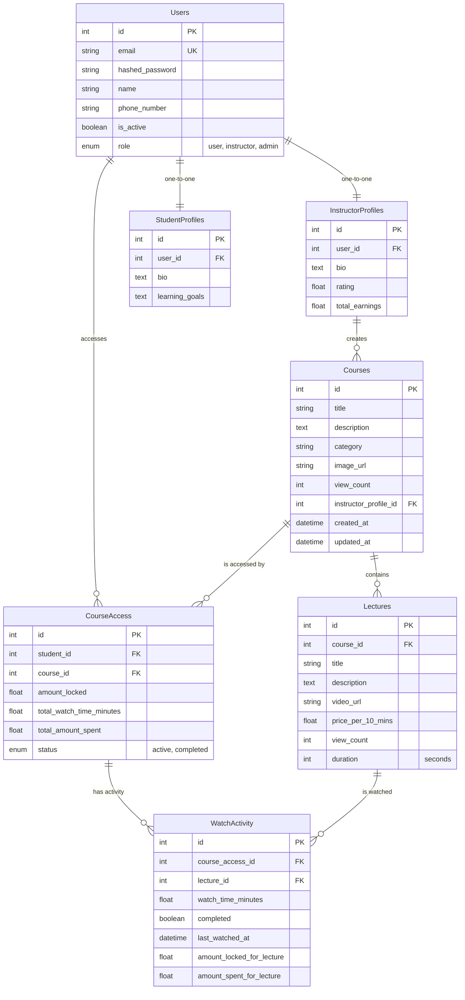

# Database Schema Documentation

This document describes the database structure for the Meanttor system, including tables, columns, constraints, and relationships.

## Entity Relationship Diagram

## Table Definitions

### 1. `users`
Core table for all user types (Students, Instructors, Admins).
- `id`: Primary Key.
- `email`: Unique email address.
- `hashed_password`: Bcrypt hashed password.
- `name`: User's full name.
- `phone_number`: User's contact number.
- `is_active`: Boolean status.
- `role`: Enum (`user`, `instructor`, `admin`).

### 2. `instructor_profiles`
Extended profile for search and earnings for Instructors.
- `id`: Primary Key.
- `user_id`: Foreign Key to `users.id`.
- `bio`: Professional summary.
- `rating`: Average student rating.
- `total_earnings`: Cumulative revenue.

### 3. `student_profiles`
Extended profile for learning preferences for Students.
- `id`: Primary Key.
- `user_id`: Foreign Key to `users.id`.
- `bio`: Short student bio.
- `learning_goals`: Description of what they want to achieve.

### 4. `courses`
Catalog of available learning content.
- `id`: Primary Key.
- `title`: Course name.
- `description`: Detailed summary.
- `category`: e.g., 'Web Development', 'Design'.
- `image_url`: Thumbnail image.
- `view_count`: Total course views.
- `instructor_profile_id`: Foreign Key to `instructor_profiles.id`.

### 5. `lectures`
Individual units of content within a course.
- `id`: Primary Key.
- `course_id`: Foreign Key to `courses.id`.
- `title`: Lecture title.
- `video_url`: Link to the video content.
- `price_per_10_mins`: Pricing model for usage.
- `duration`: Length of video in seconds.

### 6. `course_access`
Tracks which student is accessing which course and financial locks.
- `id`: Primary Key.
- `student_id`: Foreign Key to `users.id`.
- `course_id`: Foreign Key to `courses.id`.
- `amount_locked`: Current funds locked for usage.
- `total_watch_time_minutes`: Cumulative watch time for the course.
- `status`: Tracking if the course is `active` or `completed`.

### 7. `watch_activity`
Granular tracking of per-lecture watch time.
- `id`: Primary Key.
- `course_access_id`: Foreign Key to `course_access.id`.
- `lecture_id`: Foreign Key to `lectures.id`.
- `watch_time_minutes`: Time spent on this specific lecture.
- `completed`: Whether the student finished this lecture.
- `last_watched_at`: Timestamp of most recent activity.
- `amount_locked_for_lecture`: Funds locked specifically for this lecture upon starting.
- `amount_spent_for_lecture`: Total funds permanently charged for this specific lecture.
