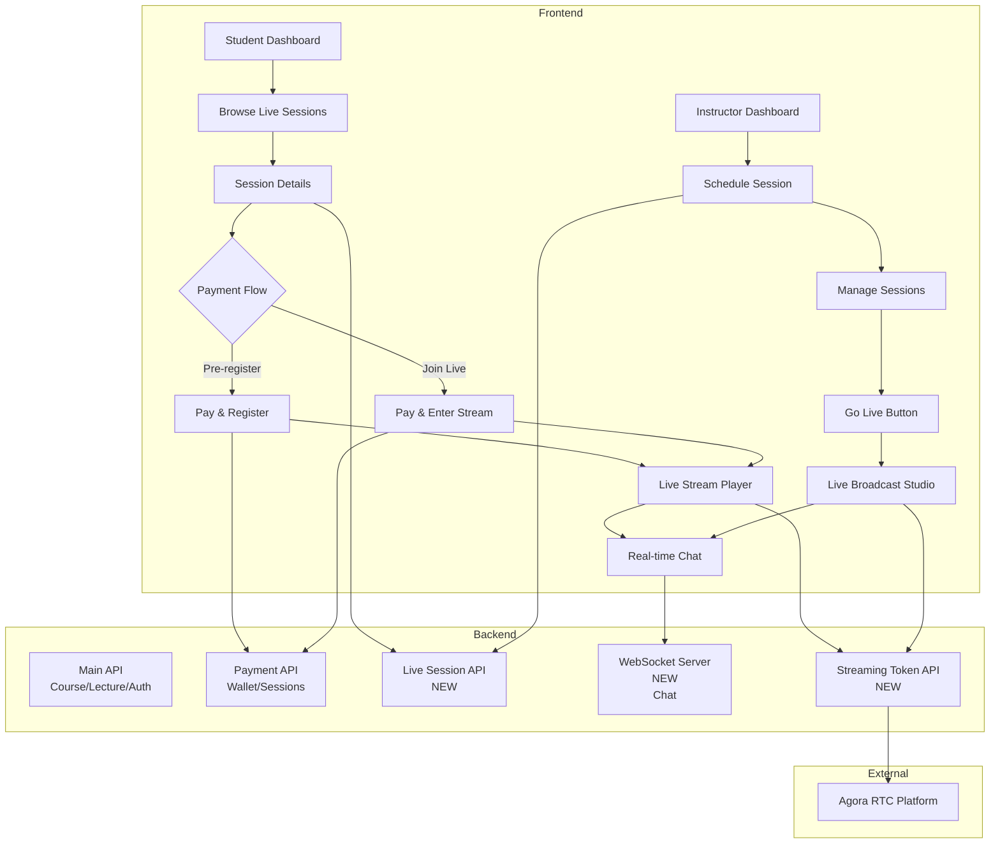

# Live Video Streaming Platform Implementation Plan

This plan outlines the implementation of a live video/audio streaming platform where instructors can schedule live sessions, students can register and pay to attend, and participants can engage via real-time chat during the stream.

## User Review Required

> [!IMPORTANT]
> **Backend API Development Required**
> This implementation requires new backend endpoints that don't currently exist in your API. You'll need to implement these endpoints in your FastAPI backend before the frontend can function. See the "Backend API Requirements" section for detailed specifications.

> [!IMPORTANT]
> **Streaming Service Selection**
> I recommend using **Agora RTC SDK** for video streaming due to:
> - Free tier: 10,000 minutes/month
> - Low latency (< 400ms)
> - Excellent React SDK support
> - Built-in screen sharing and quality controls
> 
> Alternative: **100ms** (similar features, different API)
> 
> **Please confirm your preference or if you have an existing Agora/100ms account.**

> [!WARNING]
> **Payment Flow Design Decision**
> The plan includes two payment options:
> 1. **Pre-registration**: Pay in advance when registering (can join anytime during live session)
> 2. **Join on-the-fly**: Pay only when joining a live session
> 
> Both deduct from the existing wallet balance. **Please confirm this approach is acceptable.**

> [!CAUTION]
> **WebSocket Server Required**
> Real-time chat requires a WebSocket server endpoint. This needs to be added to your backend. If you prefer a simpler implementation without real-time chat for the MVP, please let me know.

---

## Architecture Overview



---

## Proposed Changes

### Backend API Requirements

> [!NOTE]
> These endpoints need to be implemented in your FastAPI backend at `https://sequestrable-elsie-knurliest.ngrok-free.dev`

#### Live Session Schema

```python
class LiveSession:
    id: int
    title: str
    description: str
    instructor_id: int
    scheduled_start: datetime
    scheduled_end: datetime
    actual_start: datetime | None
    actual_end: datetime | None
    status: str  # "scheduled", "live", "ended", "cancelled"
    price: float  # Fixed price for session
    max_participants: int | None
    thumbnail_url: str | None
    category: str
    created_at: datetime
    
class SessionRegistration:
    id: int
    session_id: int
    student_id: int
    paid_amount: float
    registered_at: datetime
    attended: bool
```

#### Required Endpoints

**Instructor Endpoints:**
- `POST /instructor/live-sessions` - Create scheduled session
- `GET /instructor/live-sessions` - List instructor's sessions
- `GET /instructor/live-sessions/{id}` - Get session details
- `PUT /instructor/live-sessions/{id}` - Update session (only if not started)
- `DELETE /instructor/live-sessions/{id}` - Cancel session (refund registrants)
- `POST /instructor/live-sessions/{id}/start` - Mark session as live
- `POST /instructor/live-sessions/{id}/end` - End session
- `GET /instructor/live-sessions/{id}/participants` - Get registered/attending users

**Student Endpoints:**
- `GET /student/live-sessions` - Browse available sessions (scheduled + live)
- `GET /student/live-sessions/{id}` - Get session details
- `POST /student/live-sessions/{id}/register` - Pre-register with payment
- `POST /student/live-sessions/{id}/join` - Join live session with payment
- `GET /student/live-sessions/my-registrations` - Get user's registrations

**Streaming Token Endpoint:**
- `POST /streaming/token` - Generate Agora token
  - Request: `{ session_id: int, user_id: int, role: "publisher" | "subscriber" }`
  - Response: `{ token: str, channel_name: str, uid: int, expiry: datetime }`

**WebSocket Endpoint:**
- `WS /ws/live-sessions/{session_id}/chat` - Real-time chat
  - Messages: `{ user_id: int, username: str, message: str, timestamp: datetime }`

---

### Frontend Implementation

#### Component Structure

```
src/
├── pages/
│   ├── instructor/
│   │   ├── [NEW] InstructorLiveSessionNew.tsx
│   │   ├── [NEW] InstructorLiveSessionList.tsx
│   │   └── [NEW] InstructorLiveStudio.tsx
│   └── student/
│       ├── [NEW] StudentLiveSessionBrowse.tsx
│       └── [NEW] StudentLiveSessionView.tsx
├── components/
│   ├── live/
│   │   ├── [NEW] LivePlayer.tsx
│   │   ├── [NEW] LiveChat.tsx
│   │   ├── [NEW] LiveSessionCard.tsx
│   │   ├── [NEW] LiveIndicator.tsx
│   │   └── [NEW] SessionScheduleCalendar.tsx
│   └── dialogs/
│       ├── [NEW] SessionRegistrationDialog.tsx
│       └── [NEW] PaymentConfirmationDialog.tsx
├── hooks/
│   ├── [NEW] useAgoraRTC.ts
│   ├── [NEW] useLiveChat.ts
│   └── [NEW] useLiveSession.ts
└── lib/
    └── [MODIFY] api.ts
```

---

#### [MODIFY] [api.ts](file:///c:/Users/rpgra/Downloads/filler_naem/filler_naem/engage-learn/src/lib/api.ts)

**Changes:**
- Add `LiveSession`, `SessionRegistration`, `ChatMessage` interfaces
- Add live session API methods to `ApiClient` class
- Add streaming token generation method
- Add chat WebSocket connection helper

**New Interfaces:**
```typescript
export interface LiveSession {
  id: number;
  title: string;
  description: string;
  instructor_id: number;
  instructor_name?: string;
  scheduled_start: string;
  scheduled_end: string;
  actual_start?: string;
  actual_end?: string;
  status: 'scheduled' | 'live' | 'ended' | 'cancelled';
  price: number;
  max_participants?: number;
  current_participants?: number;
  thumbnail_url?: string;
  category: string;
  created_at: string;
}

export interface SessionRegistration {
  id: number;
  session_id: number;
  session?: LiveSession;
  student_id: number;
  paid_amount: number;
  registered_at: string;
  attended: boolean;
}

export interface ChatMessage {
  id: string;
  user_id: number;
  username: string;
  message: string;
  timestamp: string;
}

export interface StreamingToken {
  token: string;
  channel_name: string;
  uid: number;
  expiry: string;
}
```

**New API Methods:**
```typescript
// Instructor Methods
async createLiveSession(data): Promise<LiveSession>
async getInstructorLiveSessions(): Promise<LiveSession[]>
async updateLiveSession(id, data): Promise<LiveSession>
async deleteLiveSession(id): Promise<{message: string}>
async startLiveSession(id): Promise<LiveSession>
async endLiveSession(id): Promise<LiveSession>
async getSessionParticipants(id): Promise<SessionRegistration[]>

// Student Methods
async getBrowseLiveSessions(): Promise<LiveSession[]>
async getLiveSession(id): Promise<LiveSession>
async registerForSession(id): Promise<SessionRegistration>
async joinLiveSession(id): Promise<SessionRegistration>
async getMyRegistrations(): Promise<SessionRegistration[]>

// Streaming
async getStreamingToken(sessionId, role): Promise<StreamingToken>
```

---

#### [NEW] [InstructorLiveSessionNew.tsx](file:///c:/Users/rpgra/Downloads/filler_naem/filler_naem/engage-learn/src/pages/InstructorLiveSessionNew.tsx)

**Purpose:** Form for instructors to schedule new live sessions

**Key Features:**
- Title, description, category inputs
- Date/time picker for scheduled start/end
- Price input (fixed amount)
- Max participants (optional)
- Thumbnail upload
- Form validation with react-hook-form + zod
- Creates session via API
- Redirects to session list on success

---

#### [NEW] [InstructorLiveSessionList.tsx](file:///c:/Users/rpgra/Downloads/filler_naem/filler_naem/engage-learn/src/pages/InstructorLiveSessionList.tsx)

**Purpose:** Manage all scheduled/live/past sessions

**Key Features:**
- Tabs for "Upcoming", "Live", "Past"
- Session cards with status indicators
- Edit/delete scheduled sessions
- "Go Live" button for scheduled sessions at start time
- "End Stream" button for live sessions
- View participant list
- Revenue tracking per session

---

#### [NEW] [InstructorLiveStudio.tsx](file:///c:/Users/rpgra/Downloads/filler_naem/filler_naem/engage-learn/src/pages/InstructorLiveStudio.tsx)

**Purpose:** Broadcasting interface for live streaming

**Key Features:**
- Video preview (instructor's camera)
- Screen sharing toggle
- Microphone/camera controls
- Participant count (real-time)
- Live chat panel
- Network quality indicator
- Session timer
- "End Session" button
- Uses Agora RTC SDK for publishing

---

#### [NEW] [StudentLiveSessionBrowse.tsx](file:///c:/Users/rpgra/Downloads/filler_naem/filler_naem/engage-learn/src/pages/StudentLiveSessionBrowse.tsx)

**Purpose:** Browse and discover live sessions

**Key Features:**
- Filter by category, status (upcoming/live), price
- Search by title/description
- Grid of `LiveSessionCard` components
- Live indicator for currently streaming sessions
- "Register" button for scheduled sessions
- "Join Now" button for live sessions
- Shows registered sessions separately

---

#### [NEW] [StudentLiveSessionView.tsx](file:///c:/Users/rpgra/Downloads/filler_naem/filler_naem/engage-learn/src/pages/StudentLiveSessionView.tsx)

**Purpose:** Watch live stream and interact via chat

**Key Features:**
- Split layout: video player (70%) + chat (30%)
- Live video stream using Agora SDK
- Real-time chat with WebSocket
- Session info panel (title, instructor, duration)
- Participant count
- Full-screen mode
- Payment verification on mount
- Auto-reconnect on network issues

---

#### [NEW] [LivePlayer.tsx](file:///c:/Users/rpgra/Downloads/filler_naem/filler_naem/engage-learn/src/components/live/LivePlayer.tsx)

**Purpose:** Reusable Agora video player component

**Key Features:**
- Subscribe to remote video streams
- Handle multiple video tracks (camera + screen share)
- Audio visualization
- Network quality indicators
- Loading states
- Error handling

**Dependencies:** Agora React SDK

---

#### [NEW] [LiveChat.tsx](file:///c:/Users/rpgra/Downloads/filler_naem/filler_naem/engage-learn/src/components/live/LiveChat.tsx)

**Purpose:** Real-time chat component

**Key Features:**
- WebSocket connection management
- Message list with auto-scroll
- Message input with emoji picker
- User avatars
- Instructor badge for instructor messages
- Timestamp formatting
- Reconnection handling

---

#### [NEW] [useAgoraRTC.ts](file:///c:/Users/rpgra/Downloads/filler_naem/filler_naem/engage-learn/src/hooks/useAgoraRTC.ts)

**Purpose:** React hook for Agora RTC management

**Exports:**
```typescript
interface UseAgoraRTC {
  localTracks: { video: ILocalVideoTrack, audio: ILocalAudioTrack };
  remoteTracks: Map<number, IRemoteVideoTrack>;
  isPublishing: boolean;
  startPublishing: () => Promise<void>;
  stopPublishing: () => Promise<void>;
  toggleMute: () => void;
  toggleVideo: () => void;
  shareScreen: () => Promise<void>;
  error: Error | null;
}
```

---

#### [NEW] [useLiveChat.ts](file:///c:/Users/rpgra/Downloads/filler_naem/filler_naem/engage-learn/src/hooks/useLiveChat.ts)

**Purpose:** WebSocket chat management hook

**Exports:**
```typescript
interface UseLiveChat {
  messages: ChatMessage[];
  sendMessage: (text: string) => void;
  isConnected: boolean;
  error: Error | null;
}
```

---

#### [MODIFY] [App.tsx](file:///c:/Users/rpgra/Downloads/filler_naem/filler_naem/engage-learn/src/App.tsx#L62-L112)

**Changes:**
- Add routes for live session pages
- Instructor routes: `/instructor/live-sessions`, `/instructor/live-sessions/new`, `/instructor/live-studio/:sessionId`
- Student routes: `/student/live-sessions`, `/student/live-sessions/:sessionId`

---

#### [MODIFY] [StudentDashboard.tsx](file:///c:/Users/rpgra/Downloads/filler_naem/filler_naem/engage-learn/src/pages/StudentDashboard.tsx)

**Changes:**
- Add "Browse Live Sessions" card
- Add "My Registered Sessions" section showing upcoming sessions
- Live indicator for currently streaming sessions

---

#### [MODIFY] [InstructorDashboard.tsx](file:///c:/Users/rpgra/Downloads/filler_naem/filler_naem/engage-learn/src/pages/InstructorDashboard.tsx)

**Changes:**
- Add "Schedule Live Session" card
- Add "My Live Sessions" section showing upcoming/live sessions
- Add "Go Live" quick action button
- Show revenue from live sessions

---

#### [MODIFY] [Navbar.tsx](file:///c:/Users/rpgra/Downloads/filler_naem/filler_naem/engage-learn/src/components/Navbar.tsx)

**Changes:**
- Add "Live Sessions" navigation link for both roles
- Add live indicator badge when user has active sessions

---

### Package Dependencies

Add to `package.json`:
```json
{
  "dependencies": {
    "agora-rtc-react": "^2.3.0",
    "agora-rtc-sdk-ng": "^4.21.0",
    "date-fns": "^3.6.0", // Already installed
    "react-day-picker": "^8.10.1" // Already installed
  }
}
```

---

## Verification Plan

### Backend Verification

**Prerequisites:**
1. Backend must be running with all new endpoints implemented
2. Database migrations applied for `live_sessions` and `session_registrations` tables
3. Agora App ID and App Certificate configured in backend environment

**API Tests:**
```bash
# Test live session creation
curl -X POST https://sequestrable-elsie-knurliest.ngrok-free.dev/instructor/live-sessions \
  -H "Authorization: Bearer <instructor_token>" \
  -H "Content-Type: application/json" \
  -d '{
    "title": "Test Live Session",
    "description": "Testing streaming",
    "scheduled_start": "2026-02-10T10:00:00Z",
    "scheduled_end": "2026-02-10T11:00:00Z",
    "price": 99.0,
    "category": "Technology"
  }'

# Test session listing
curl https://sequestrable-elsie-knurliest.ngrok-free.dev/student/live-sessions \
  -H "Authorization: Bearer <student_token>"

# Test registration
curl -X POST https://sequestrable-elsie-knurliest.ngrok-free.dev/student/live-sessions/1/register \
  -H "Authorization: Bearer <student_token>"
```

### Frontend Verification

**Automated Tests:**
Currently no test infrastructure exists in the project. Manual testing will be required.

**Manual Testing Steps:**

#### Instructor Flow:
1. Start dev server: `npm run dev`
2. Login as instructor
3. Navigate to "Live Sessions" → "Schedule New"
4. Fill form with session details (scheduled 5 minutes from now)
5. Click "Create Session"
6. **Verify:** Session appears in "Upcoming" tab
7. Wait until scheduled time
8. Click "Go Live" button
9. **Verify:** Camera/microphone permissions requested
10. **Verify:** Video preview appears
11. **Verify:** Session status changes to "Live"
12. Send test messages in chat
13. Click "End Session"
14. **Verify:** Session moves to "Past" tab

#### Student Flow:
1. Open incognito window, start dev server
2. Login as student (different account)
3. Navigate to "Live Sessions" → "Browse"
4. **Verify:** See scheduled session from instructor
5. Click "Register" on scheduled session
6. **Verify:** Payment confirmation dialog appears
7. Confirm payment
8. **Verify:** Wallet balance decreases by session price
9. **Verify:** Session appears in "My Registrations"
10. When instructor goes live, refresh page
11. **Verify:** Session shows "Live" indicator
12. Click "Join Session"
13. **Verify:** Video player loads and shows instructor stream
14. Send chat messages
15. **Verify:** Messages appear in real-time
16. **Verify:** Instructor's chat messages visible

#### Payment Verification:
1. Check wallet balance before registration: note amount
2. Register for session costing 100 INR
3. **Verify:** Balance reduced by 100 INR
4. Check Payment API transaction history:
   ```bash
   curl https://overgreedily-subtruncate-theresa.ngrok-free.dev/api/v1/wallet/transactions/<user_id>
   ```
5. **Verify:** Transaction record exists for live session payment

#### Edge Cases:
1. **Insufficient Balance:** Try joining with wallet balance < session price
   - **Expected:** Error message, payment blocked
2. **Session Already Ended:** Try joining an ended session
   - **Expected:** Error message, cannot join
3. **Network Interruption:** Disconnect internet during stream
   - **Expected:** Reconnection attempt, error message if failed
4. **Concurrent Sessions:** Instructor tries to start 2 sessions simultaneously
   - **Expected:** Error or queue management

---

## Technical Notes

### Agora Setup

1. **Create Agora Account:** https://console.agora.io/
2. **Get App ID:** Create new project in Agora console
3. **Enable App Certificate:** For token-based authentication
4. **Add to Backend Environment:**
   ```env
   AGORA_APP_ID=your_app_id
   AGORA_APP_CERTIFICATE=your_app_certificate
   ```

### Token Generation (Backend)

The backend must implement token generation using Agora's RTC Token Builder:

```python
from agora_token_builder import RtcTokenBuilder
import time

def generate_agora_token(channel_name: str, uid: int, role: str):
    app_id = os.getenv("AGORA_APP_ID")
    app_certificate = os.getenv("AGORA_APP_CERTIFICATE")
    
    # Token valid for 24 hours
    expiry_time = int(time.time()) + 3600 * 24
    
    privilege_expired_ts = expiry_time
    role_publisher = 1  # Instructor
    role_subscriber = 2  # Student
    
    role_int = role_publisher if role == "publisher" else role_subscriber
    
    token = RtcTokenBuilder.buildTokenWithUid(
        app_id, app_certificate, channel_name, uid, role_int, privilege_expired_ts
    )
    
    return token
```

### WebSocket Chat Implementation

The backend needs a WebSocket endpoint for real-time chat:

```python
from fastapi import WebSocket, WebSocketDisconnect

class ConnectionManager:
    def __init__(self):
        self.active_connections: Dict[int, List[WebSocket]] = {}
    
    async def connect(self, websocket: WebSocket, session_id: int):
        await websocket.accept()
        if session_id not in self.active_connections:
            self.active_connections[session_id] = []
        self.active_connections[session_id].append(websocket)
    
    async def broadcast(self, message: dict, session_id: int):
        for connection in self.active_connections.get(session_id, []):
            await connection.send_json(message)

manager = ConnectionManager()

@app.websocket("/ws/live-sessions/{session_id}/chat")
async def chat_websocket(websocket: WebSocket, session_id: int):
    await manager.connect(websocket, session_id)
    try:
        while True:
            data = await websocket.receive_json()
            await manager.broadcast(data, session_id)
    except WebSocketDisconnect:
        manager.active_connections[session_id].remove(websocket)
```

### Payment Flow Details

**Pre-registration Payment:**
1. Student clicks "Register"
2. Frontend calls `/student/live-sessions/{id}/register`
3. Backend validates wallet balance >= session price
4. Backend creates `session_registration` record
5. Backend calls Payment API `/api/v1/wallet/deposit` with negative amount (deduction)
6. Frontend shows success, updates wallet balance

**Join Live Payment:**
1. Student clicks "Join Now" on live session
2. Same flow as pre-registration
3. Backend also marks `attended = true`

---

## Security Considerations

> [!CAUTION]
> **Token Security**
> - Never expose Agora App Certificate in frontend code
> - Always generate tokens server-side
> - Use short-lived tokens (24 hours max)
> - Validate user permissions before issuing tokens

> [!WARNING]
> **Payment Validation**
> - Always verify wallet balance server-side before allowing join
> - Prevent duplicate registrations
> - Handle race conditions for max_participants limit
> - Log all payment transactions

---

## Performance Optimizations

- Use React.memo for chat message components (prevent re-renders)
- Implement virtual scrolling for chat history if > 100 messages
- Lazy load Agora SDK (reduce initial bundle size)
- Use WebWorker for video processing if adding filters
- Cache live session lists with react-query (5-second stale time)
- Compress chat images before sending

---

## Future Enhancements (Out of Scope for MVP)

- Recording live sessions for replay
- Polls/quizzes during live sessions
- Breakout rooms for group discussions
- Instructor analytics (engagement, attendance)
- Email notifications for scheduled sessions
- Calendar integration (iCal export)
- Multi-presenter support
- Live captions/transcription

---

## Timeline Estimate

- **Backend Development:** 3-4 days (depends on your backend team)
- **Frontend Development:** 4-5 days
  - Day 1-2: API client, types, hooks
  - Day 3: Instructor pages
  - Day 4: Student pages
  - Day 5: Testing and polish
- **Integration & Testing:** 1-2 days
- **Total:** ~8-10 days for complete implementation

---

## Next Steps

1. **Review & Approve** this plan
2. **Choose streaming provider** (Agora recommended)
3. **Backend team** implements required endpoints
4. **Frontend implementation** begins (me!)
5. **Integration testing** with both systems
6. **User acceptance testing**

Please review this plan and let me know:
- ✅ Approve and proceed?
- 🔄 Modifications needed?
- ❓ Questions or concerns?
